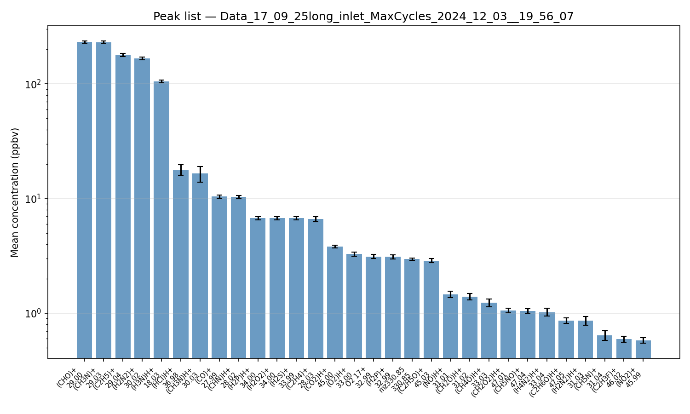
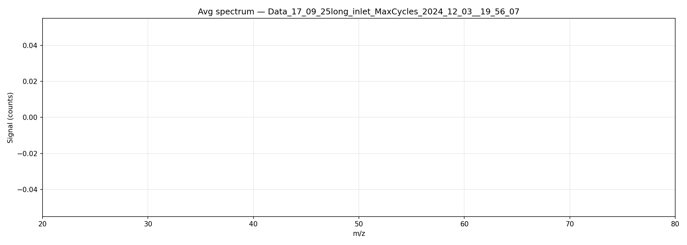
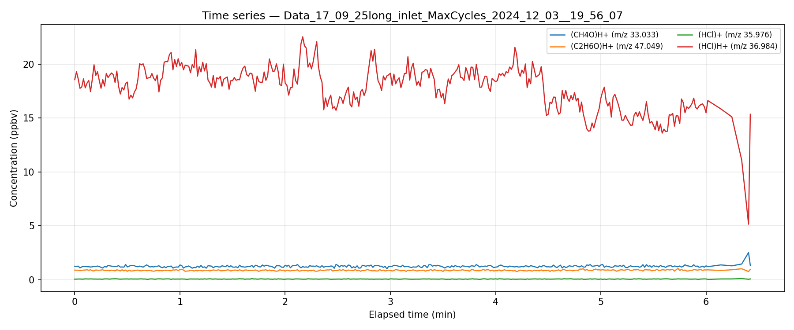

# PTR-MS Analysis

Python toolkit for analysing **Ionikon PTR-MS** HDF5 data files.  
Produces peak lists, concentration time series, and calibrated average mass spectra.

## Contents

| File | Description |
|---|---|
| `analyze_ptrms.py` | Core analysis library + CLI script |
| `ptrms_analysis.ipynb` | Jupyter notebook with inline graphics |
| `figures/` | Example output figures |

## Quick start

```bash
# Create and activate a virtual environment
python3 -m venv .venv
source .venv/bin/activate        # Windows: .venv\Scripts\activate

# Install dependencies
pip install -r requirements.txt

# Register the Jupyter kernel
python -m ipykernel install --user --name ptrms-venv --display-name "PTR-MS (.venv)"

# Run the CLI on your data file
python analyze_ptrms.py MyData.h5 --min-conc 0.1
```

## CLI usage

```
python analyze_ptrms.py <file.h5> [options]

Options:
  --min-conc PPB        Minimum mean concentration in peak list (default: 0.1)
  --top-n N             Number of peaks in bar chart (default: 30)
  --include-primary     Include primary ions (H3O+, O2+, NO+, …) in peak list
  --compounds NAME …    Plot time series for compounds matching name substrings
  --avg-spectrum        Plot the average mass spectrum
  --mz-range LO HI     m/z range for spectrum plot
  --plot                Show interactive plots instead of saving PNGs
  --no-csv              Skip writing peak list CSV
```

### Examples

```bash
# Basic peak list (saves CSV + bar chart PNG)
python analyze_ptrms.py Data.h5

# Multiple files — also writes combined_peak_list.csv
python analyze_ptrms.py *.h5 --min-conc 0.5

# Time series for specific compounds
python analyze_ptrms.py Data.h5 --compounds "CH4O" "C2H6O" "HCl"

# Average spectrum between m/z 20–200 with interactive display
python analyze_ptrms.py Data.h5 --avg-spectrum --mz-range 20 200 --plot
```

## Jupyter notebook

Open `ptrms_analysis.ipynb` using the **PTR-MS (.venv)** kernel.  
Edit the **Configuration** cell at the top to point to your files and set analysis parameters.

The notebook sections are:

1. Instrument summary (E/N, drift V/p/T, H₃O⁺ purity)
2. Primary ion composition over time
3. Coloured peak-list table
4. Peak-list bar chart (log scale)
5. Calibrated average mass spectrum with peak annotations
6. Concentration time series for compounds of interest
7. Reaction conditions (drift V, p, T, E/N) over time
8. Multi-file comparison (automatic when >1 file is loaded)

## File format notes

- **HDF5 structure**: Ionikon software stores spectra in `SPECdata/`, pre-integrated
  traces in `TRACEdata/`, instrument parameters in `AddTraces/`, and primary-ion
  diagnostics in `CalcTraces/`.
- **Timestamps**: stored as LabVIEW absolute seconds (epoch 1904-01-01 UTC).
- **Mass calibration**: `CALdata/Mapping` holds `(mass, bin)` reference pairs; the
  TOF sqrt-law `sqrt(mz) = a·bin + b` is fitted by least squares.
- **Concentrations**: `TRACEdata/TraceConcentration` is in ppbv as computed by the
  Ionikon software.

## Example figures

### Peak list


### Average spectrum (m/z 20–200)


### Time series

